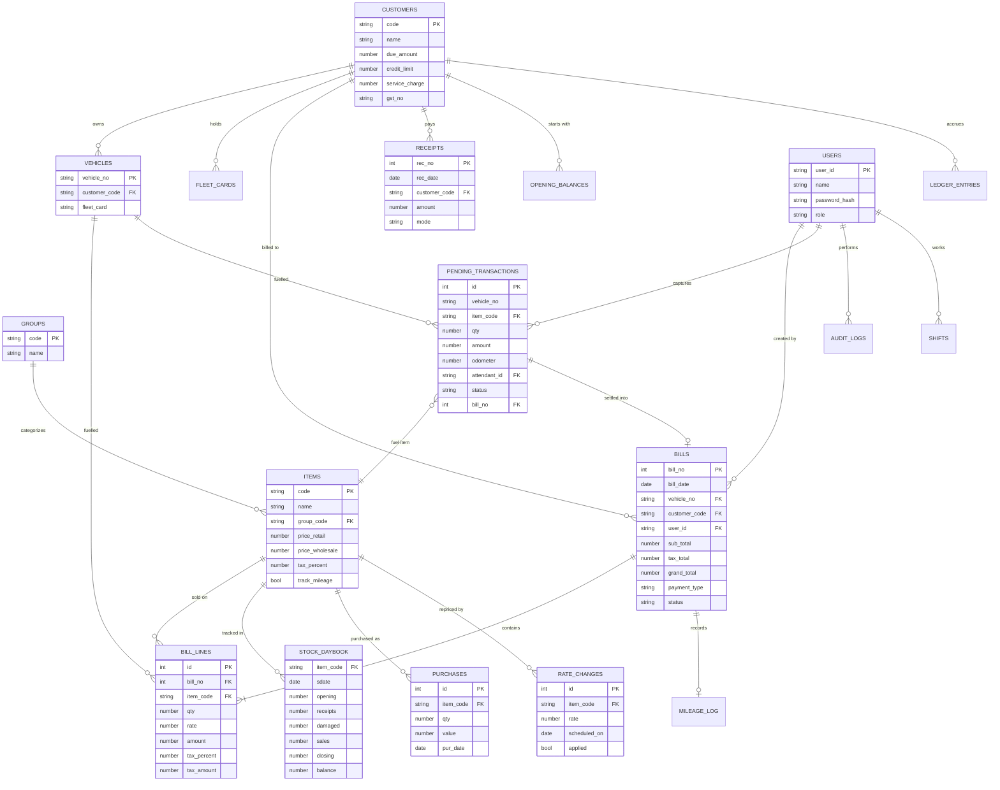

# PetroPro — Entity Relationship Diagram

Modern consolidated schema (the legacy per-month tables are merged into date-stamped tables).

## Key relationships

- **Bill → Bill lines (1:N):** a bill groups one or more item lines under a `bill_no`. Legacy stored
  only lines; PetroPro adds an explicit `bills` header carrying totals & payment.
- **Pending transaction → Bill (0..1):** an attendant entry becomes exactly one settled bill line
  when the cashier accepts payment (the new attendant→cashier flow).
- **Customer → Ledger:** `opening_balances` + `bills` (debit) + `receipts` (credit) roll into
  `ledger_entries` and the running `customers.due_amount`.
- **Item → Stock daybook:** every fuel sale decrements `sales`/`balance`; purchases increment
  `receipts`.
